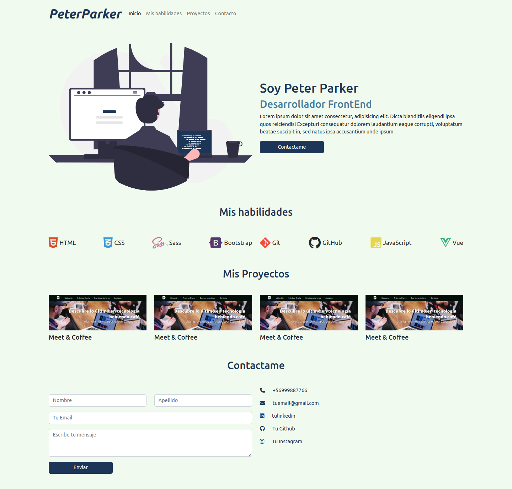

# Desafío - Mi primer portafolio
## Peter Parker - Desarrollador FrontEnd

En este desafío se validará el conocimiento sobre el uso del Framework Bootstrap junto a Sass, utilizando componentes y la grilla de Bootstrap.

Esta es la maqueta a resolver:
